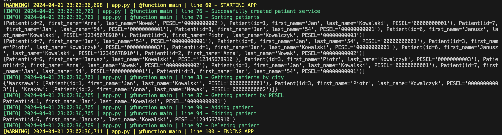

# PATIENT SERVICE

The project is a simple console application that allows you to manage patients. First approach is to take data from json file. The second approach is to take data from MySQL database. The application allows you to add, delete, update, sort, search and display patients.


## Built With
- Python
- Pytest
- Unittest
- Poetry
- MySQL
- Docker


## Getting Started
1. Clone the repo
   ```sh
   git clone https://github.com/SzymiYay/esatto
   ```
2. To start the project, you need to have Python and Poetry installed on your computer.
3. Set on the project directory.
4. Create .env file with the following content:
   ```sh
   POOL_NAME=esatto_pool
   POOL_SIZE=5
   POOL_RESET_SESSION=True
   HOST=localhost
   DATABASE=esatto
   USER_A=admin
   PASSWORD=admin
   PORT=3307
   ```
5. Create a virtual environment:
   ```sh
   poetry shell
   ```
6. Install dependencies:
   ```sh
   poetry install
   ```
7. Run docker-compose:
   ```sh
   docker-compose up
   ```
8. Run application:
   ```sh
   poetry run pyhton -m esatto
   ```
9. Run tests:
   ```sh
   poetry run pytest
   ```

## Usage


## Contributing
If you have a suggestion that would make this better, please fork the repo and create a pull request. You can also simply open an issue with the tag "enhancement".
Don't forget to give the project a star! Thanks again!

1. Fork the Project
2. Create your Feature Branch (`git checkout -b feature/new-feature`)
3. Commit your Changes (`git commit -m 'Add some new-feature'`)
4. Push to the Branch (`git push origin feature/new-feature`)
5. Open a Pull Request


## License
Distributed under the MIT License. See `LICENSE.txt` for more information.


## Contact
Szymon Frączek - szymoon09@gmail.com
